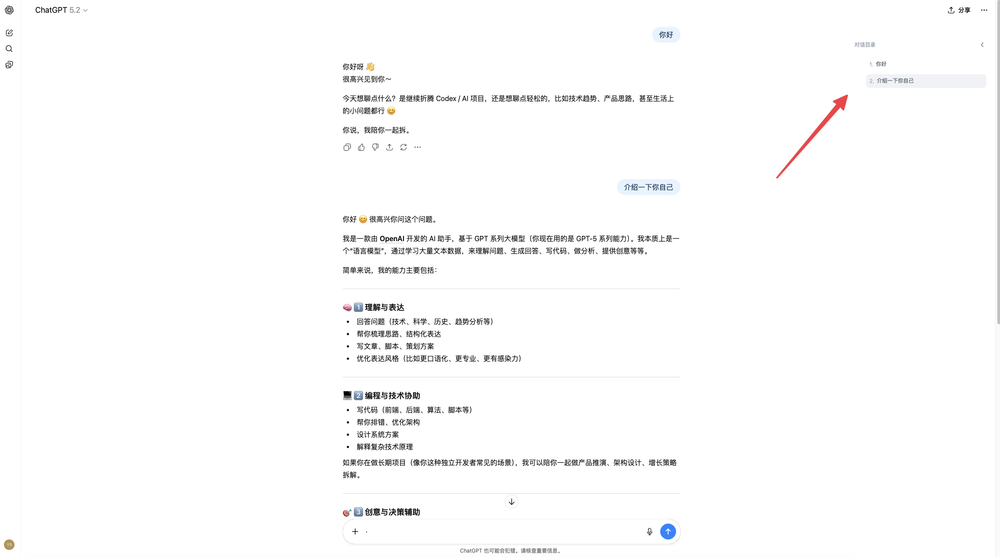

# AI Chat TOC

中文 | [English](./README_en.md)

一个为 AI 对话页面提供目录导航的 Chrome 扩展，帮助你快速定位历史提问。

## 版本

- `v0.1.0`

## 当前支持站点

- ChatGPT
- Claude
- Gemini

## 功能亮点

- 自动提取用户提问并生成目录
- 点击目录项后平滑滚动到目标消息并高亮
- 支持星标收藏，按会话 URL 隔离存储
- 滚动时自动同步当前活跃问题
- 侧边栏可折叠，界面简洁

## 演示

## 安装（开发者模式）

1. 打开 `chrome://extensions`
2. 启用“开发者模式”
3. 点击“加载已解压的扩展程序”
4. 选择项目目录：`/Users/sun/Code/ai-chat-toc-extension`

## 项目结构

- `manifest.json`：扩展清单（MV3）
- `src/content/`：解析、面板、样式、存储、站点适配器
- `src/background/`：后台 service worker
- `assets/icons/`：扩展图标
- `test/manual-checklist.md`：手动验证清单

## 发布说明

`v0.1.0` 为首个公开版本，包含核心目录导航与星标能力。
